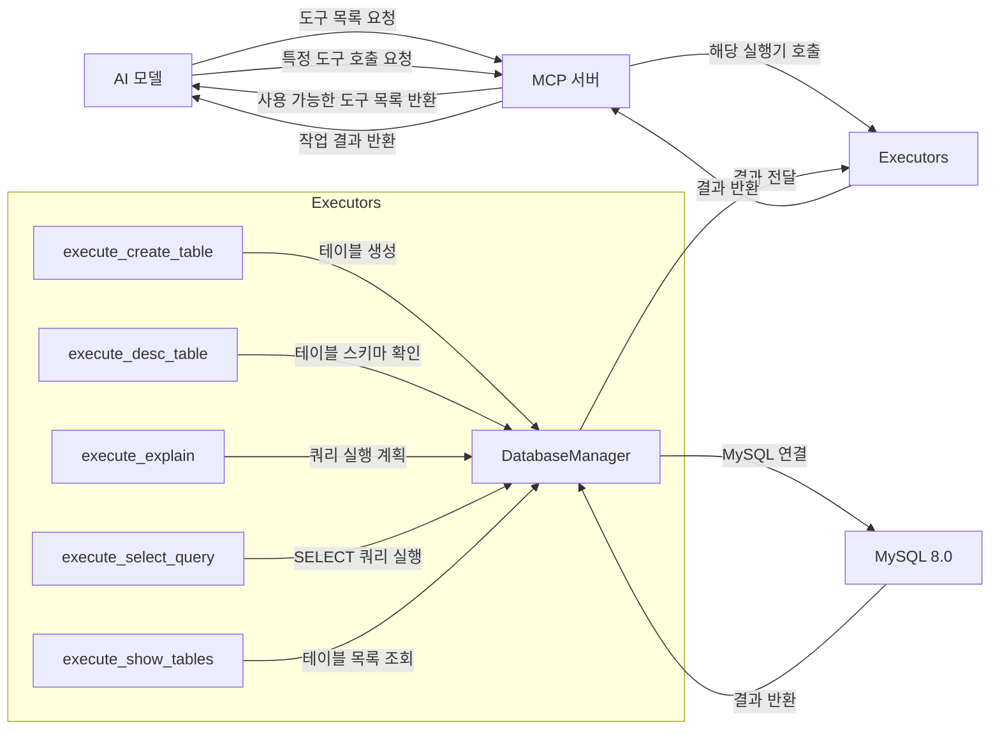

# MCPMySQLBoilerPlate

> --stdio 실행 방식은 현재 개발 단계에 있습니다.

## 0. 실습

### 설치

```
pip install -r requirements.txt
```

### 실행

```bash
python mysql_mcp_server/main.py run
```

### Tool 추가 Tips

- Tool 추가
  - `excute` 함수들은 실제 로직을 동작하게 만들어줍니다.(Service Layer)
  - `@tool` 데코레이터는 MCP에 도구를 명세 등록을 도와줍니다.(Controller Layer)
- 설명
  - `mysql_mcp_server/executors` 아래에 파일당 도구 하나 라고 봐야 합니다.
  - 도구를 하나 추가했다면, `mysql_mcp_server/executors/__init__.py` 파일에서 `import` 하고, __all__ 배열에도 추가해줍니다.
  그럼 `TOOLS_DEFINITION` 변수에 모듈들이 자동 등록이 됩니다.
  




## 1. 개요

MCPMySQLBoilerPlate는 MCP(Model Control Protocol) 기반의 MySQL 데이터베이스 작업을 위한 서버 애플리케이션입니다. 이 서버는 AI 모델이 MySQL 데이터베이스와 상호작용할 수 있도록 도구(Tools)를 제공합니다.

## 2. 시스템 구성

### 2.1 주요 컴포넌트

- **MCP 서버**: FastMCP 또는 stdio 기반 서버로 AI 모델과의 통신을 담당
- **MySQL 데이터베이스**: 데이터 저장 및 관리
- **도구(Tools)**: 데이터베이스 작업을 수행하는 실행기(Executors)

### 2.2 기술 스택

- **언어**: Python
- **데이터베이스**: MySQL 8.0
- **주요 라이브러리**:
  - mcp: AI 모델과의 통신을 위한 Model Control Protocol 구현
  - PyMySQL: MySQL 데이터베이스 연결 및 쿼리 실행
  - pandas: 데이터 처리 및 분석
  - python-dotenv: 환경 변수 관리
  - fire: 명령줄 인터페이스 구현

### 2.3 배포 환경

- Docker 및 Docker Compose를 통한 컨테이너화 배포
- 포트: 8081 (MCP 서버), 3306 (MySQL)

## 3. 디렉토리 구조

```
MCPMySQLBoilerPlate/
├── mysql_mcp_server/           # 메인 애플리케이션 디렉토리
│   ├── executors/              # 데이터베이스 작업 실행기
│   │   ├── create_table.py     # 테이블 생성 도구
│   │   ├── desc_table.py       # 테이블 스키마 확인 도구
│   │   ├── explain.py          # 쿼리 실행 계획 도구
│   │   ├── select_query.py     # SELECT 쿼리 실행 도구
│   │   └── show_tables.py      # 테이블 목록 조회 도구
│   ├── handlers/               # MCP 요청 처리기
│   │   ├── call_tool.py        # 도구 호출 처리
│   │   └── list_tools.py       # 도구 목록 제공
│   ├── helper/                 # 유틸리티 모듈
│   │   ├── db_conn_helper.py   # 데이터베이스 연결 관리
│   │   ├── logger_helper.py    # 로깅 유틸리티
│   │   └── tool_decorator.py   # 도구 데코레이터
│   ├── models/                 # 데이터 모델
│   └── main.py                 # 애플리케이션 진입점
├── docker-compose.yml          # Docker Compose 설정
├── Dockerfile                  # Docker 이미지 빌드 설정
├── requirements.txt            # 의존성 패키지 목록
└── .env.example                # 환경 변수 예시
```

## 4. 아키텍처 설계

### 4.1 계층 구조

1. **인터페이스 계층**: MCP 서버 (FastMCP 또는 stdio)
2. **비즈니스 로직 계층**: 핸들러 및 실행기
3. **데이터 액세스 계층**: 데이터베이스 연결 및 쿼리 실행

### 4.2 주요 클래스 및 모듈

- **MySQLMCPServer**: 메인 서버 클래스로 MCP 서버 초기화 및 실행
- **DatabaseManager**: 싱글톤 패턴을 사용한 데이터베이스 연결 관리자
- **Executors**: 데이터베이스 작업을 수행하는 도구 모음
  - execute_create_table: 테이블 생성
  - execute_desc_table: 테이블 스키마 확인
  - execute_explain: 쿼리 실행 계획
  - execute_select_query: SELECT 쿼리 실행
  - execute_show_tables: 테이블 목록 조회

### 4.3 통신 흐름

1. AI 모델이 MCP 서버에 도구 목록 요청
2. 서버가 사용 가능한 도구 목록 반환
3. AI 모델이 특정 도구 호출 요청
4. 서버가 해당 도구의 실행기를 호출하여 데이터베이스 작업 수행
5. 작업 결과를 AI 모델에 반환

## 5. 확장성 및 유지보수

- **도구 추가**: executors 디렉토리에 새로운 도구 구현 후 __init__.py에 등록
- **환경 설정**: .env 파일을 통한 환경 변수 관리
- **로깅**: logger_helper를 통한 일관된 로깅 시스템

## 6. 배포 및 실행

### 6.1 로컬 실행

```bash
# 환경 설정
cp .env.example .env
# 필요에 따라 .env 파일 수정

# 의존성 설치
pip install -r requirements.txt

# 서버 실행
python mysql_mcp_server/main.py run
```

### 6.2 Docker 배포

```bash
# Docker Compose로 DB 실행
docker-compose up -d db
# Docker Compose로 mysql mcp server 이미지 빌드 후 실행(재빌드 포함)
docker-compose up -d --build mysql-mcp-server 
```

## 7. 보안 고려사항

- 데이터베이스 자격 증명은 환경 변수를 통해 관리
- 프로덕션 환경에서는 강력한 비밀번호 사용 권장
- 필요한 경우 SSL/TLS를 통한 데이터베이스 연결 암호화 구현 고려
